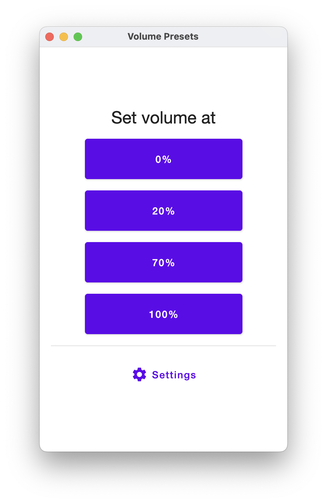
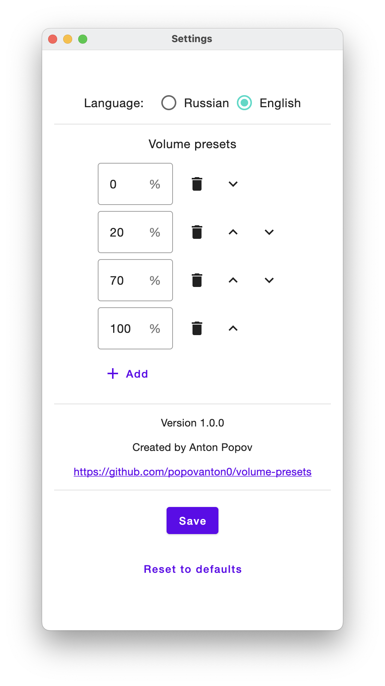

# Volume Presets

Control volume levels on your computer easily, using predefined presets.

Created using [Jetpack Compose for Desktop](https://www.jetbrains.com/lp/compose-desktop/)

<!-- [**Download**](TODO) -->

| Main Screen  | Settings Screen |
| ------------- | ------------- |
|   |   |

